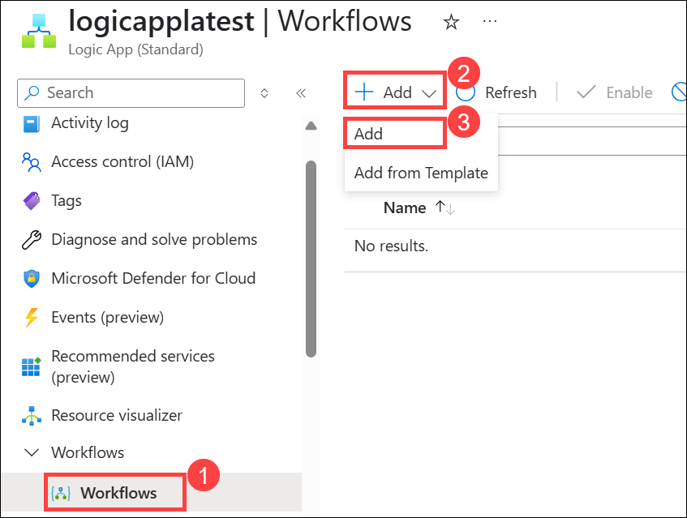
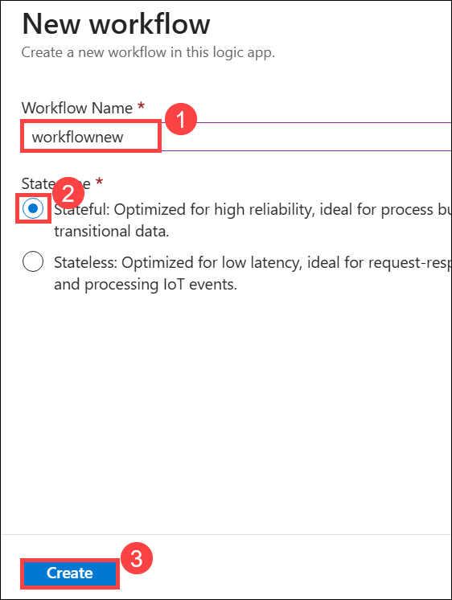
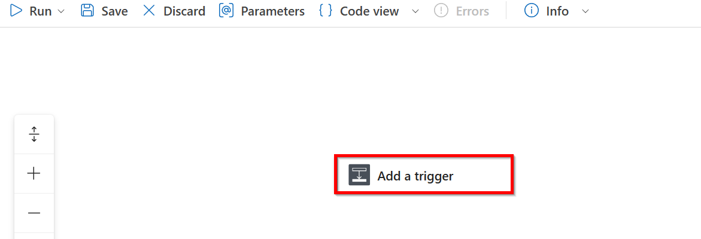
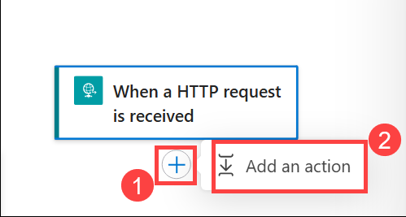
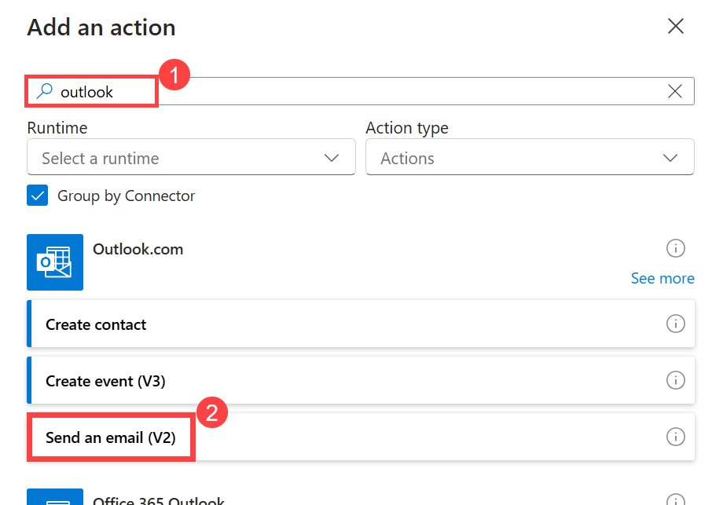
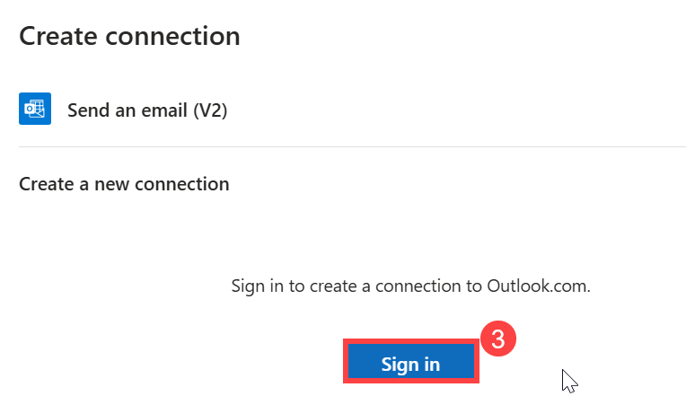
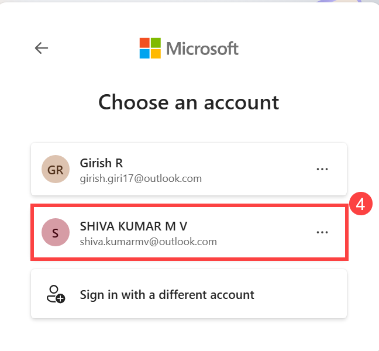
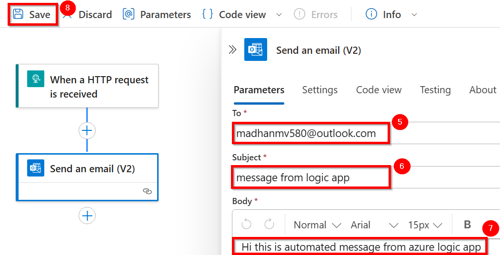
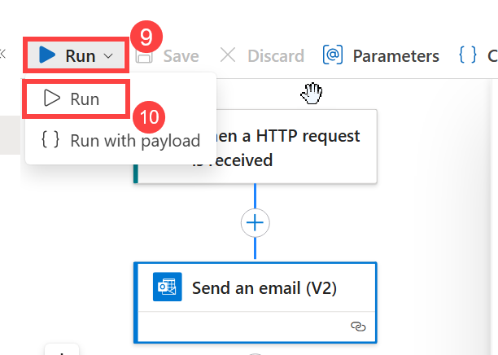
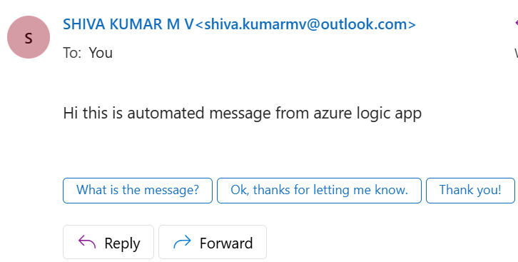

# HTTP-Triggered Email Workflow Using Azure Logic App

## Overview

In this scenario, you will create a Logic App using the Azure Portal that is triggered by an HTTP request. When the Logic App receives the request, it will automatically send an email using a configured email connector such as Outlook or Gmail. This demonstrates how Logic Apps can be used to create simple yet powerful automated workflows that integrate webhooks and communication tools without writing code.

## Prerequisites

  - An Azure account with an active subscription. [Create/Login Azure account](https://portal.azure.com/#home)

## Getting Started With Lab

1. Click on this link to [Login to azure account](https://portal.azure.com/#home)

2. You'll see the **Sign into Microsoft Azure** tab. Here, enter your credentials
   
      - **Email/username:** `madhanmv580@gmail.com`
      
        

3. Next, Provide your password

   - **Password:** `azurepswd!`
     
     

4. If prompted to stay signed in , click **NO**

5. In the Azure Portal, use the **search bar** at the top. Type **Logic app** (1) From the search results, click on **Logic app** (2) under the Services section.

   

6. From the **Logic apps** page, click on **+ Add** (1) on top left.

   

7. Under hosting options , select **Workflow service Plan** **(2)** From Standard and click on **select** **(3)**.

   

8. Create a new **Logi app** with an Workflow service Plan. Use the folling details.

   |Label|Name|
   |---|---|
   |**Subscription**|Innova8 Training|
   |**Resource group**|shiva.kumarmv|

   

9. Under **Instance Details**. Fill the following details.

   |Label|Name|
   |---|---|
   |**Logic app Name**|logicapplatest|
   |**region**|west us 2|
   |**Windows Plan**|logicappwinplan|

   - Click on **OK** **(5)**

   

10. Leave Zone redundancy as default and click on **Next : Storage** **(6)**

   

11. Under storage fill the following details and click on **Review + Create** **(5)**

   - **Storage type** : Azure storage
     
   - Click on **Create new**

     - **Name** : logicappsstoragelatest
    
     - Click on **OK** **(4)**
    
     

12. After Validation click on **Create**.

    

13. Once deployment is done, click **Go to Resource**  In the new page.

    

14. In the Overview of Logic app Click the workflow and select **workflows** **(1)** in the left side bar.

    - Click on **+ Add** **(2)** and select **Add** **(3)**

      

15. A new workflow will open in right-side and fill the following details.

    - **Workflow Name** : workflownew
      
    - **state type** : stateful
   
    - **click** : create

      

16. After creating Blank Workflow You should now see an "Add a trigger" (1) option. Click on it.

    
    
18. Click on Add a trigger , a new add trigger will open on right side.

    - Navigate to search bar and search request (1) and click on request app.
   
      

19. Click on Plus button **+** **(1)** below the Http Request **Add an action** **(2)** will pops click on it.

    

20. A new **add an action** will open on right side.

    - Navigate to search bar and search **outlook** (1) and click on **send an email**.

      

    - Click on **Sign in**
   
      

21. Enter username and password or click on already existing account.

    

22. Enter the following details to send mail and click on **save** **(8)**.

     - **To** : madhanmv580@outlook.com
   
     - **subject** : message from logic app
   
     - **Body** : Hi this is automated message from azure logic app
   
       

23. On top left click on **Run** **(9)**.

    

24. check mail to verify the message.

    
    

    
    

