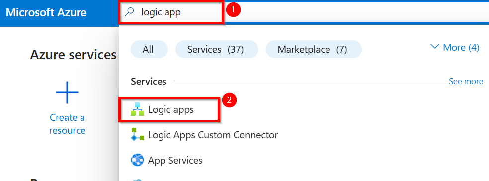
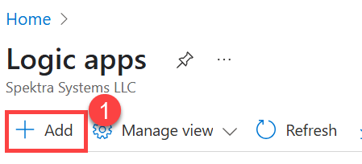
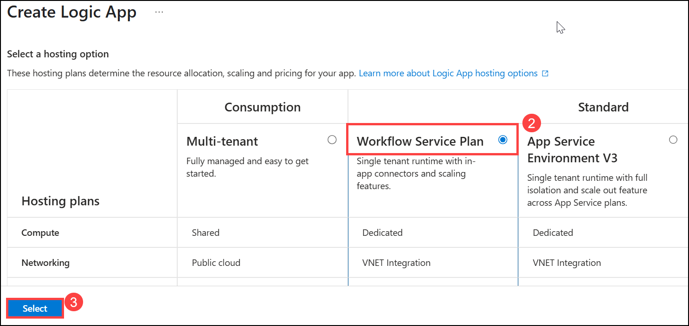
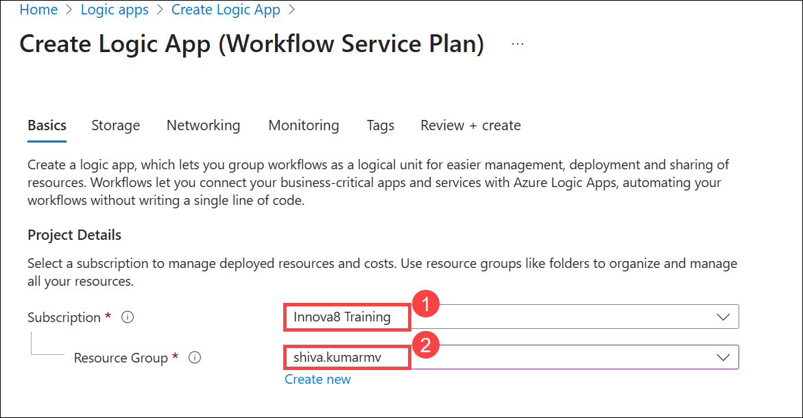
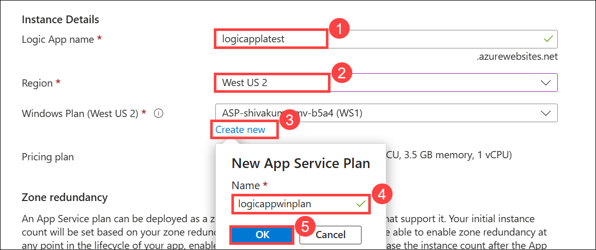
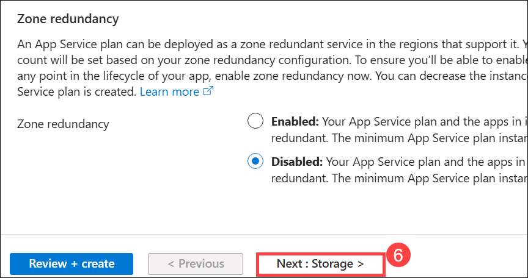
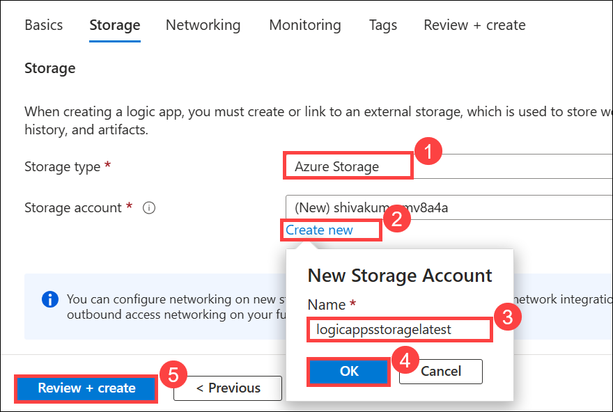
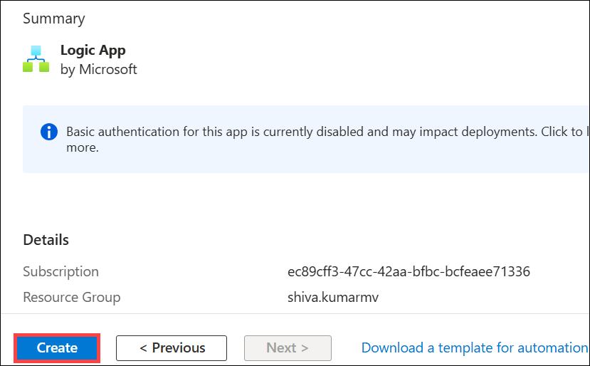
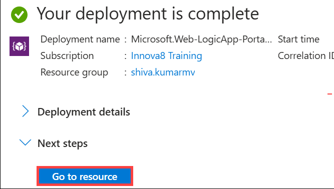
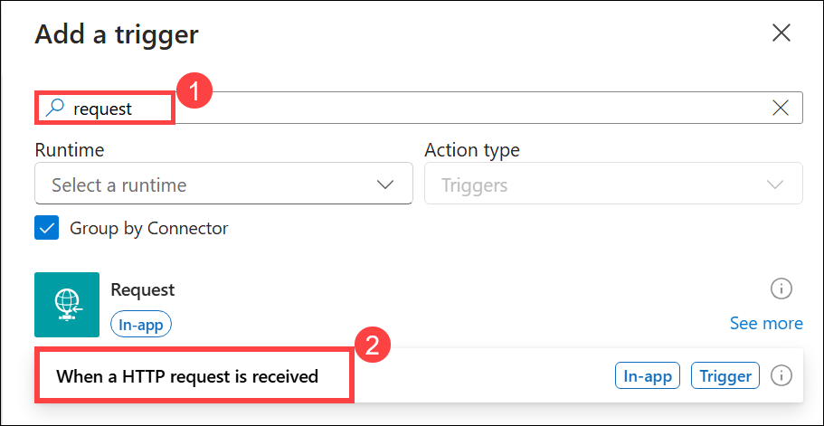

## Getting Started With Lab

1. Click on this link to [Login to azure account](https://portal.azure.com/#home)

2. You'll see the **Sign into Microsoft Azure** tab. Here, enter your credentials
   
      - **Email/username:** `madhanmv580@gmail.com`
      
        

3. Next, Provide your password

   - **Password:** `azurepswd!`
     
     

4. If prompted to stay signed in , click **NO**

5. In the Azure Portal, use the **search bar** at the top. Type **Logic app** (1) From the search results, click on **Logic app** (2) under the Services section.

   

6. From the **Logic apps** page, click on **+ Add** (1) on top left.

   

7. Under hosting options , select **Workflow service Plan** **(2)** From Standard and click on **select** **(3)**.

   

8. Create a new **Logi app** with an Workflow service Plan. Use the folling details.

   |Label|Name|
   |---|---|
   |**Subscription**|Innova8 Training|
   |**Resource group**|shiva.kumarmv|

   

9. Under **Instance Details**. Fill the following details.

   |Label|Name|
   |---|---|
   |**Logic app Name**|logicapplatest|
   |**region**|west us 2|
   |**Windows Plan**|logicappwinplan|

   - Click on **OK** **(5)**

   

8. Leave Zone redundancy as default and click on **Next : Storage** **(6)**

   

9. Under storage fill the following details and click on **Review + Create** **(5)**

   - **Storage type** : Azure storage
     
   - Click on **Create new**

     - **Name** : logicappsstoragelatest
    
     - Click on **OK** **(4)**
    
     

10. After Validation click on **Create**.

    

11. Once deployment is done, click **Go to Resource**  In the new page.

    

12. In the Overview of Logic app Click the workflow and select **workflows** **(1)** in the left side bar.

    - Click on **+ Add** **(2)** and select **Add** **(3)**

   

13. A new workflow will open in right-side and fill the following details.

    - **Workflow Name** : workflownew
      
    - **state type** : stateful
   
    - **click** : create

14. d

15. Click on Add a trigge , a new add trigger will open on right side and fill the blanks.

    - Navigate search bar and search request (1) and click on request app.
   
      

16. 
    

