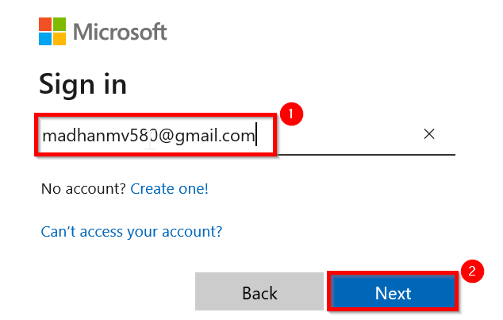
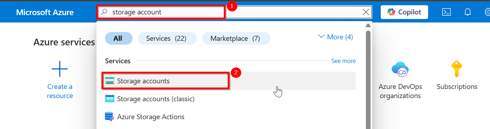

# Building an Event-Driven Azure Function for Blob Storage Triggers

## Overview

In this scenario, you will create an Azure Function App using Visual Studio Code (VS Code) and integrate it with an Azure Storage Account. The Storage Account will have a container named "images" where uploaded files will be stored. The Azure Function will be configured to trigger automatically whenever a new image is uploaded to the container. Upon triggering, the function will display the name and size of the uploaded image, demonstrating how serverless functions can process events in real-time.

## Objective

This exercise is designed to provide hands-on experience in setting up an event-driven Azure Function and integrating it with Azure Storage. By completing this task, you will learn to:

  - Create an Azure Function App: Develop a serverless function using VS Code and deploy it to Azure.
  - Integrate with Azure Storage: Connect the function to a Storage Account container to monitor for new uploads.
  - Trigger and Process Events: Configure the function to automatically trigger when an image is uploaded and extract metadata (name and size).
  - Validate the Solution: Verify that the function executes correctly by uploading an image and checking the logs for the expected output.

## Prerequisites

  - An Azure account with an active subscription. [Create/Login Azure account](https://portal.azure.com/#home)
  - Visual Studio Code. [Download visual studios code](https://code.visualstudio.com/)

## Getting Started With Lab

1. Click on this link to [Login to azure account](https://portal.azure.com/#home) and enter following details.

   **Username** :`madhanmv580@gmail.com`
   
   **Password** : `azurepswd!`

2. Go to the bottom-left corner of your screen and click the **Start** (Windows) button **(1)**. In the search bar, type **Visual Studio Code** **(2)**. When you see **Visual Studio Code** in the search results, click **(3)** it to open the VSCode.

   

3. On the **left sidebar**, click on the **Azure** **(1)** icon (it looks like an "A" or a cloud).
       - If you don't see it, press `Ctrl+Shift+X` to open the **Extensions** tab, search for `Azure Tools`, and install it.
   
4 After clicking the Azure icon, you'll see a panel labeled **Account & Tenants** **(2)** click it and Click on **"Sign in to Azure..."** **(3)** button. Now a pop message will come just click **Allow**.

   

5. A browser window will open. Enter **Email** **(1)** and click **Next** **(2)**, Enter Password **(3)** and click on **sign in** **(4)**

          

6. In Visual Studio Code, press **Ctrl+Shift+P** to open the command palette, Enter **Azure Functions: Create Function...** **(1)** , and select **Create new project** **(2)**.

   

7. In **Visual Studio Code**, when prompted to select a folder for your project, the **Select Folder** dialog will appear. From the left panel, click on **Desktop** **(3)**. Click the **New folder** **(4)** button at the top.
   
8. A new folder will be created with the default name `New folder`. Rename it to something meaningful, such as `Functionapp` **(5)** and then click the **Select** **(6)** button at the bottom right.

   

9. From the "Select a language" dropdown, click on **Python** **(7)**. Now choose your Python interpreter. Click on **python3 3.11.9** **(8)**

   
   
   

10. Next, select a template for the function. Click on **Blob trigger** **(9)**. Type Name of the function — for example: **functionblob_trigger1** **(10)**

    
   
    

11. Enter the path your function will monitor in the storage container **images** **(11)** then press Enter.

    

12. Select the storage account type. Click on **Use Azure Storage for remote storage** **(12)** and select the storage account form the drop down **funappstorage** **(13)** and finally click on **open in current windows** **(14)**

    

    

    

13. In the Azure Portal, use the search bar at the top. Type **storage account** **(1)** From the search results, **click on Storage accounts** **(2)** under the Services section.

    

14. From the storage account page select your account **funappstoarge** **(3)** and Go to **Security + networking** **(4)** > click  **Access keys** **(5)** and  Copy the **Connection string** **(6)** under `key1` for use in your application.

    

15. Open the **local.settings.json** **(7)** file in your Function App project. Paste the copied `connection string` into the **AzureWebJobsStorage** **(8)** field.

    
    
    
