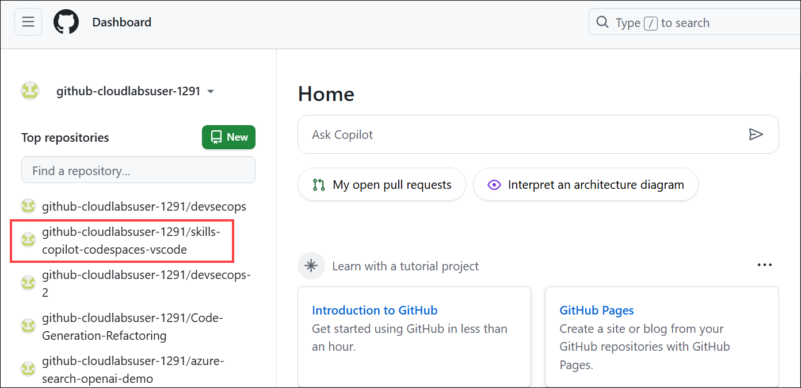
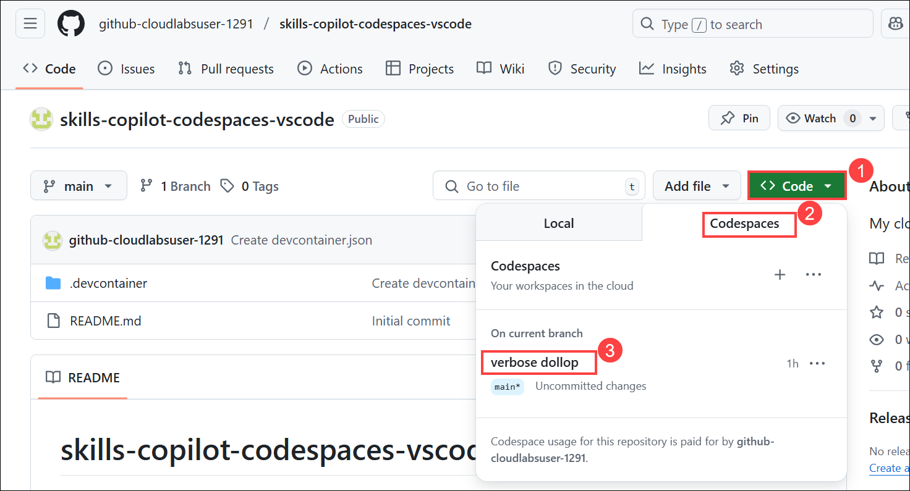

## Login to GitHub

1. In the LABVM desktop search for **Microsoft Edge** **(1)**, click on **Microsoft Edge** **(2)** browser.

   
   


1. Navigate to GitHub login page using the provided URL below:
   ```
   https://github.com/login
   ```
1. On the **Sign in to GitHub** tab, you will see the login screen. In that screen, enter the following **email** **(1)** and **password** **(2)**. Then click on **Sign in** **(3)**. 

   >**Note**: To get GitHub credentials navigate to the **Environment** tab and click on the **GitHub Credentials** option to view the key-value pairs of the **GitHub UserEmail**, and **GitHub Password**. You can use the copy buttons under the actions column to have the values copied instantly. Alternatively, it is suggested to have the values copied over onto a notepad for easy accessibility. 
   
   
   

          
1. Next, to get the authentication code, sign in to Outlook (https://outlook.office365.com/mail/) with the git credentials within the Environment tab from the previous step. Once you have logged into Outlook, find the recent email containing the verification code. Enter the verification code and click on **Verify**.

   >**Note:** The email containing the verification code can sometimes creep into the archive/spam folders within your Outlook.
   
   
   

1. Go to your **Dashboard**. On the left-hand panel under **Top repositories**, find and click on **skills-copilot-codespaces-vscode**.

   

1. Click the Code (1) button located in the middle of the page. Click the Codespaces (2) tab on the box that pops up and then click on existing codespace is listed (3).

   

   >**Note**: If in case pop-up prompt doesn't appear in the browser to open Visual Studio code, manually launch Visual Studio code from the desktop and close it. Next, return to the browser, refresh the page and launch the codespace that was previously created.

1. You will encounter a pop-up prompt, Click **Open** to proceed. Subsequently, another pop-up window will appear within Visual Studio Code (VS Code), where you should select **Install Extension and Open URI** to continue.

   
   

   
   

      >**Note**: Click on **Allow** if the extension **Github Codepsaces** wants to sign in using Github.

   

1. Click on Continue on Select user to authorize Visual Studio Code.

   
   
1. You will encounter a pop-up prompt, Click Open to proceed.

   

1. In visual studio code at the top next to the search bar, click on the showed icon, to sign in to GitHub.

   

1. On the pop-up window that appears, click on Sign in.
   
   

1. Click Continue, once the Select user to authorize Visual Studio Code tab appears in the browser.

   


