# AZURE APP SERVICE CREATION

# OVERVIEW

This guide outlines the steps to create an Azure App Service and set up continuous deployment (CI/CD) using GitHub Actions. By integrating GitHub with Azure, you can        automate your application's deployment process, ensuring that updates to your codebase are seamlessly reflected in your live application.

## TASKS

1. Login to azure account
   
2. Click on **search** **(1)** bar.
   
   

3. Type **app services** **(1)** in the search. Under Services, select **App Services** **(2)**.

   

4. In the App Services page, click on **Create** **(1)** on top left.

   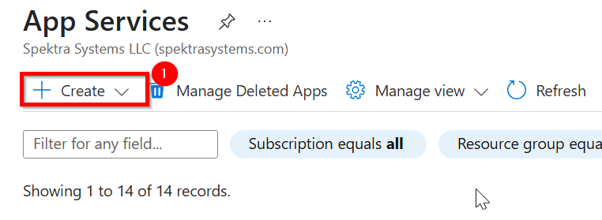

5. Click on **Web App** **(2)**. The Create web app page opens.

   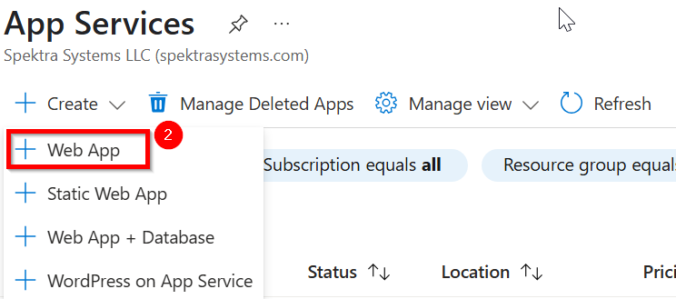

6. Under **project details** , select **subscription** **(1)** `Innova8 Training` and create or select respective **resource group** **(2)** name `shiva.kumarmv`

   |Label|Name|
   |---|---|
   |Subscription|Innova8 Training|
   |Resource group| shiva.kumarmv|

   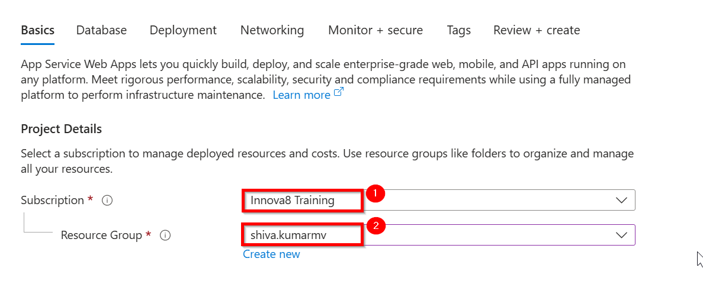

7. Under **Instance details**, enter a globally unique name for your web app `booksstore` for the name **(3)** and choose Publish **(4)** `code`, Under Runtime stack select java 17 **(5)** , for java web server stack select apache tomcat 10.1 **(6)**, Under Operating System, select Linux and choose region **(7)** `west us`

   |Label|Name|
   |---|---|
   |Name|booksstore|
   |Publish|code|
   |Runtime stack|java 17|
   |java web server stack|apache tomcat 10.1 |
   |Operating System|code|Linux|
   |region|west us|

   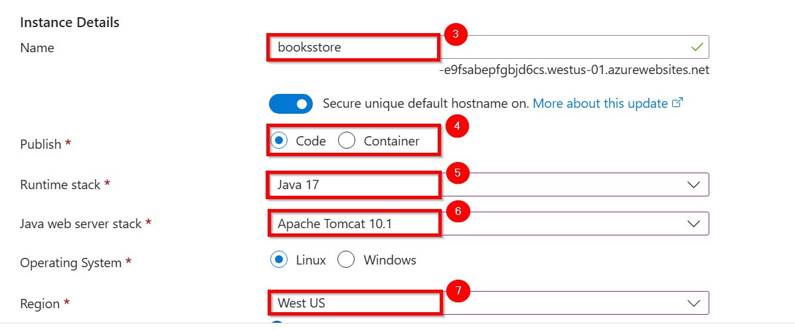

8. Under Pricing Plans, select Create new and type webonline for the name and clikc ok.
   
   |Label|Name|
   |---|---|
   |Linux plan|webonline|

   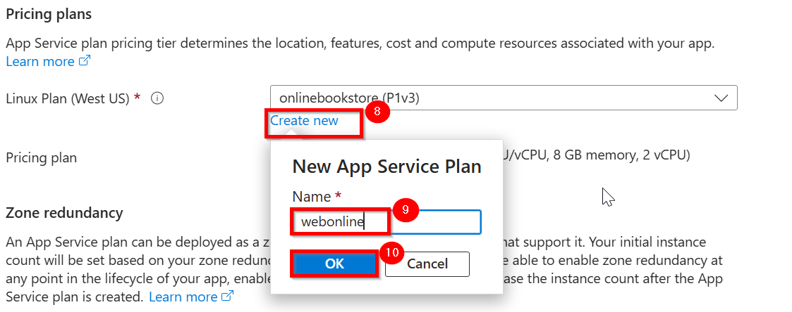

9. Under Pricing plan, Premium V3 P1V3 (195 minimum ACU/vCPU, 8 GB memory, 2 vCPU), and Click the next - Database (12) button at the bottom of the page.

    |Label|Name|
    |---|---|
    |Pricing plan|Premium V3 P1V3|

    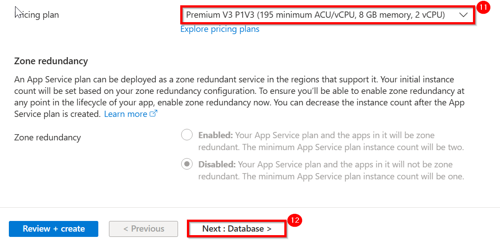

10. Under databse leave evrything as default and select the next - Deployment (1) button at the bottom of the page.

    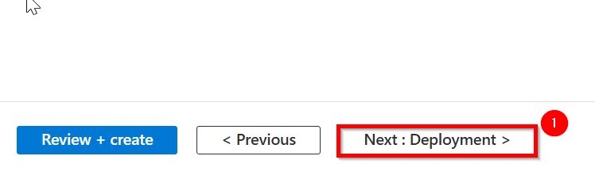

11. In Deployment tab , Under Continuous deployment settings, set Continuous deployment to Enable.

    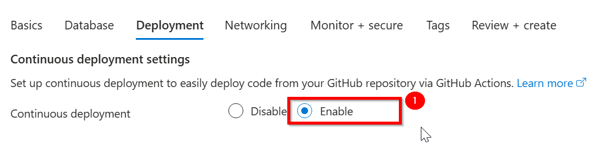

12. Under GitHub Actions details, authenticate with your GitHub account, and click chnage account.

    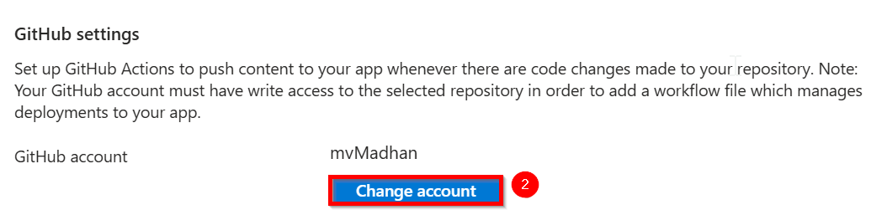

13. Configure your github account and click Authorize AzureAppService.

    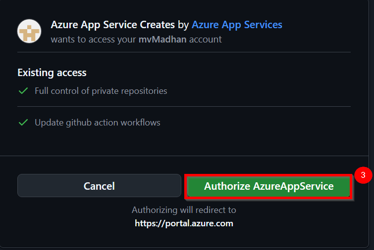

14. Verfiy your git hub account name , enter github account password and click on confirm.

    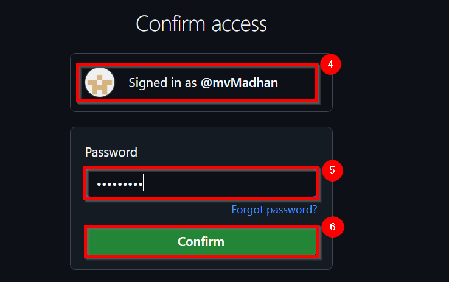

15. Under Github Settings, For Organization, select the organization name `mvMadhan`, For Repository, select the `onlinebookstore` and For Branch, select `master`.

    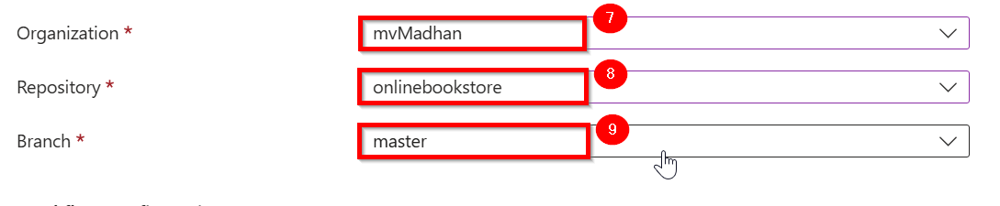

16. Under Authentication setting , set Basic Authentication to Enable and then select the Review + create **(4)** button at the bottom of the page.

    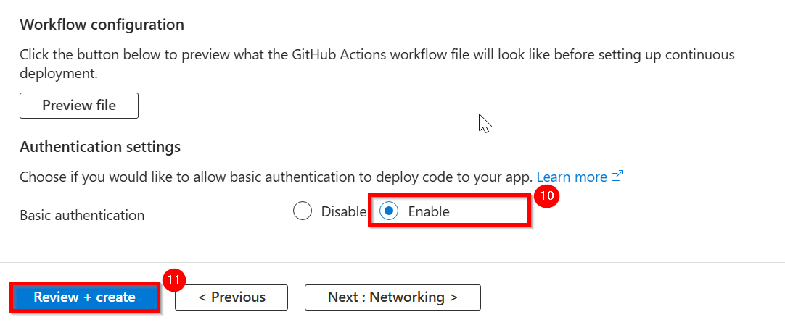

17. After validation runs, select the Create (1) button at the bottom of the page

    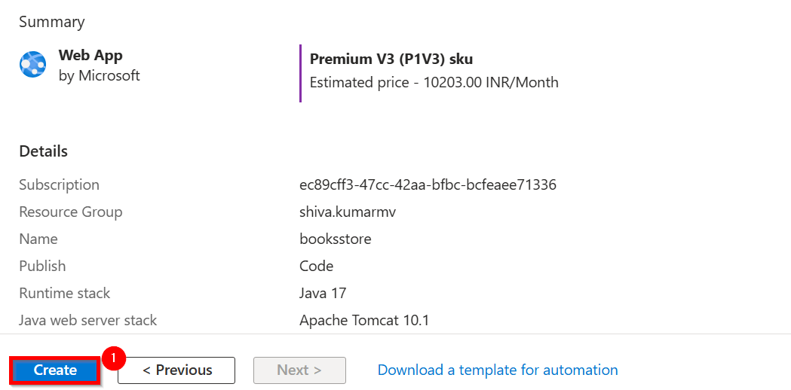

18. After deployment is complete, select Go to resource (1).

    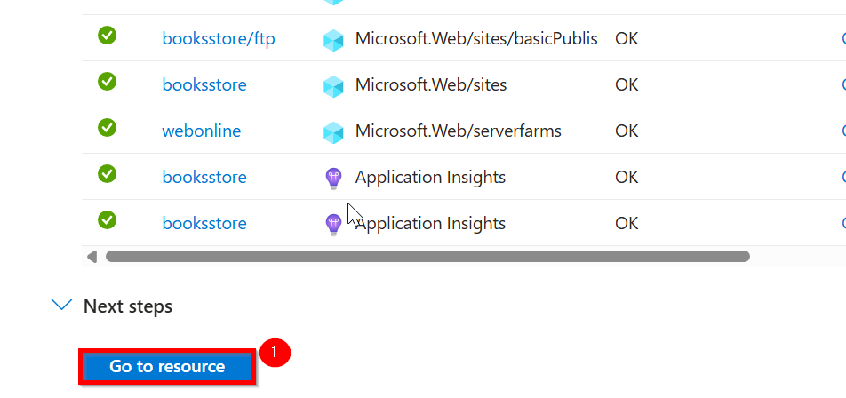

19. On the overview page for your App Services, Click on default domain name it will route to browser and If you see the message Your web app is running and waiting for your content, GitHub deployment is still running. Wait a couple of minutes and refresh the page.

    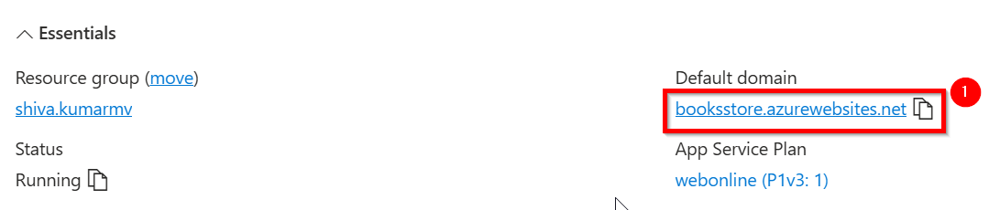

    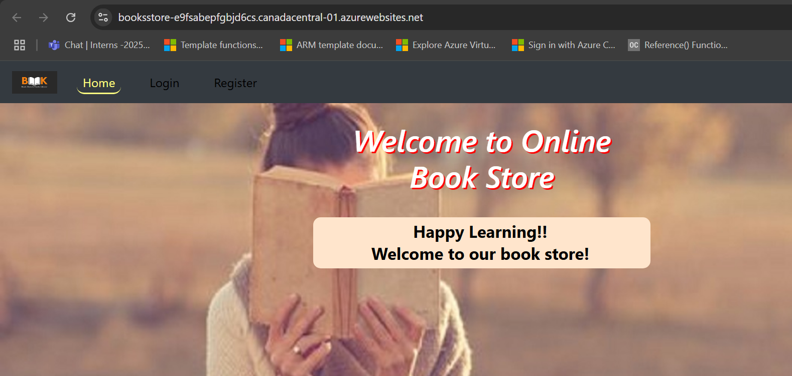

    
    

   

   
